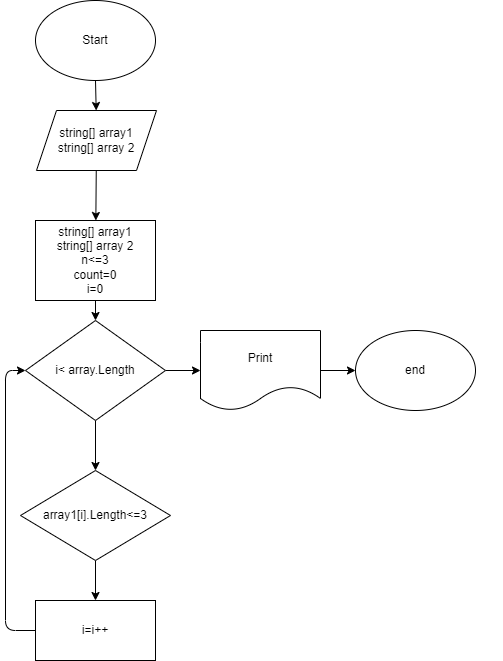

# Задача:

Написать программу, которая из имеющегося массива строк формирует новый массив из строк, длина которых меньше, либо равна 3 символам. Первоначальный массив можно ввести с клавиатуры, либо задать на старте выполнения алгоритма. При решении не рекомендуется пользоваться коллекциями, лучше обойтись исключительно массивами.

# Блок схема:

# Решение:

1. Пользователь вводит размерность исходного массива
2. Функция generateArray отвечает за ввод данных в массив.
3. Функция printArray отвечает за вывод данных в массив.
4. Функция thirdsimvol отвечает за бизнес логику:
* считается количество элементов массива с тремя и менее символами в исходном массиве;
* создается новый массив размерностью равному посчитанному ранее количеству элементов;
* элементы с тремя и менее символами исходного массива вносятся в новый массив.